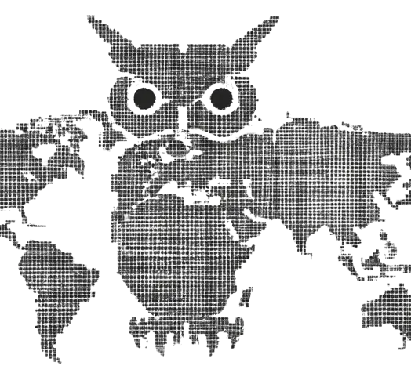

<div align="center">
  
  <h1>CyberOwl AI</h1>
  <p>Aggregates security advisories from 10 international CERTs daily and provides an AI skill that cross-references alerts against your project's tech stack.</p>
  <p>
    <a href="https://cyberowlai.com"><strong>cyberowlai.com</strong></a> &nbsp;&middot;&nbsp;
    <a href="https://cyberowlai.com/activity/">Browse Alerts</a> &nbsp;&middot;&nbsp;
    <a href="https://cyberowlai.com/skill.html">Get the Skill</a> &nbsp;&middot;&nbsp;
    <a href="https://cyberowlai.com/alerts.json">JSON API</a>
  </p>
</div>

---

## AI Skill

Add the CyberOwl AI skill to your IDE. It scans your dependencies, Dockerfiles, CI configs, and infrastructure — then tells you which alerts actually affect your project.

**Claude Code:**
```bash
mkdir -p .claude/skills/cyberowlai && curl -o .claude/skills/cyberowlai/SKILL.md https://cyberowlai.com/skill/SKILL.md
```

**Cursor:**
```bash
mkdir -p .cursor/rules && curl -o .cursor/rules/cyberowlai.md https://cyberowlai.com/skill/SKILL.md
```

Then run `/cyberowlai` or just ask *"any security alerts for my project?"*

---

## Sources

| Source | Region | Source | Region |
|---|---|---|---|
| US-CERT (CISA) | United States | HK-CERT | Hong Kong |
| CERT-FR | France | CA-CCS | Canada |
| MA-CERT | Morocco | IBM X-Force | Global |
| EU-CERT | European Union | ZeroDayInitiative | Global |
| OBS Vigilance | Global | VulDB | Global |

---

## How it works

1. **Scrapy spiders** scrape 10 CERT websites daily via GitHub Actions
2. Alerts are written to `docs/activity/*.md` (per-source markdown) and `alerts.json` (structured feed)
3. **VuePress** builds the website from the markdown and deploys to S3
4. The **AI skill** fetches `alerts.json` and matches alerts against your project's tech stack

## License

MIT
